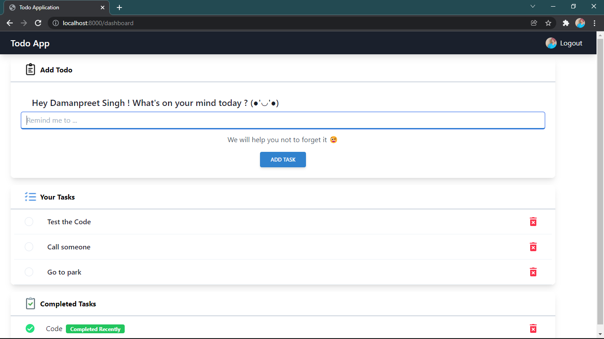

## Todo with reminders



A node js project to remind you about your todos, to be completed over the email.
Sounds fun, Right !


## Getting Started

To get a local copy up and running follow these simple example steps.

### Prerequisites

list of things you need to use the software.
* npm
  ```sh
  npm install npm@latest -g
  ```

### Installation

1. Clone the repo
   ```sh
   git clone https://github.com/data-pirate/Todo-app-with-reminders.git
   ```
2. Install NPM packages
   ```sh
   cd server
   npm install
   ```
3. Create `.env` file
   ```js
    PORT = Your port
    GOOGLE_CLIENT_ID = Your Google Oauth2 id
    GOOGLE_CLIENT_SECRET = Your oauth2 secret
    DB_LINK = Link to your data base
    COOKIE_SECRET = strong password
    MY_MAIL = email from which mail to be send
    MAIL_PASS = password for mail
   ```
4. Run the app
    ```js
    npm start
    ```

## Contributing

Contributions are what make the open source community such an amazing place to learn, inspire, and create. Any contributions you make are **greatly appreciated**.

If you have a suggestion that would make this better, please fork the repo and create a pull request. You can also simply open an issue with the tag "enhancement".
Don't forget to give the project a star! Thanks again!

1. Fork the Project
2. Create your Feature Branch (`git checkout -b feature/AmazingFeature`)
3. Commit your Changes (`git commit -m 'Add some AmazingFeature'`)
4. Push to the Branch (`git push origin feature/AmazingFeature`)
5. Open a Pull Request

## Contact

Damanpreet singh - [@twitter_handle](https://twitter.com/its_damanpreet) - dmnprt4@gmail.com

Project Link: [https://github.com/data-pirate/Todo App with reminders](https://github.com/data-pirate/Todo-app-with-reminders)
[product-screenshot]: server/images/screenshot.png
